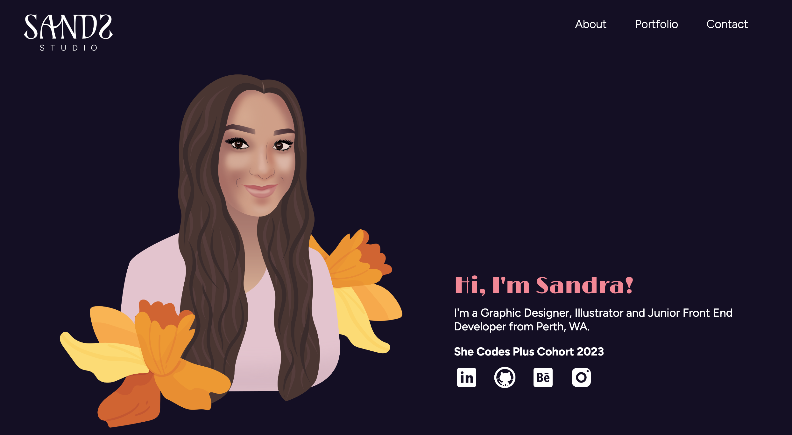
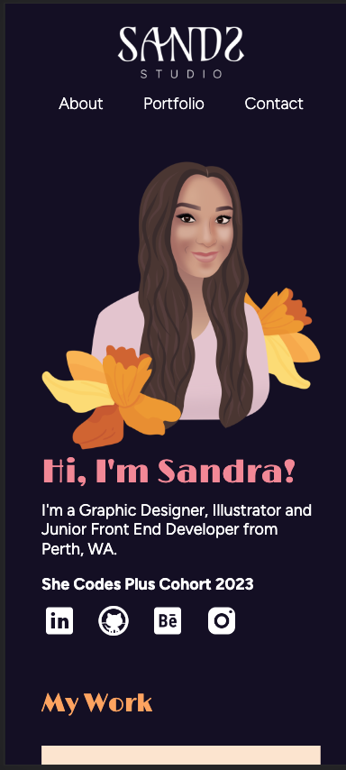
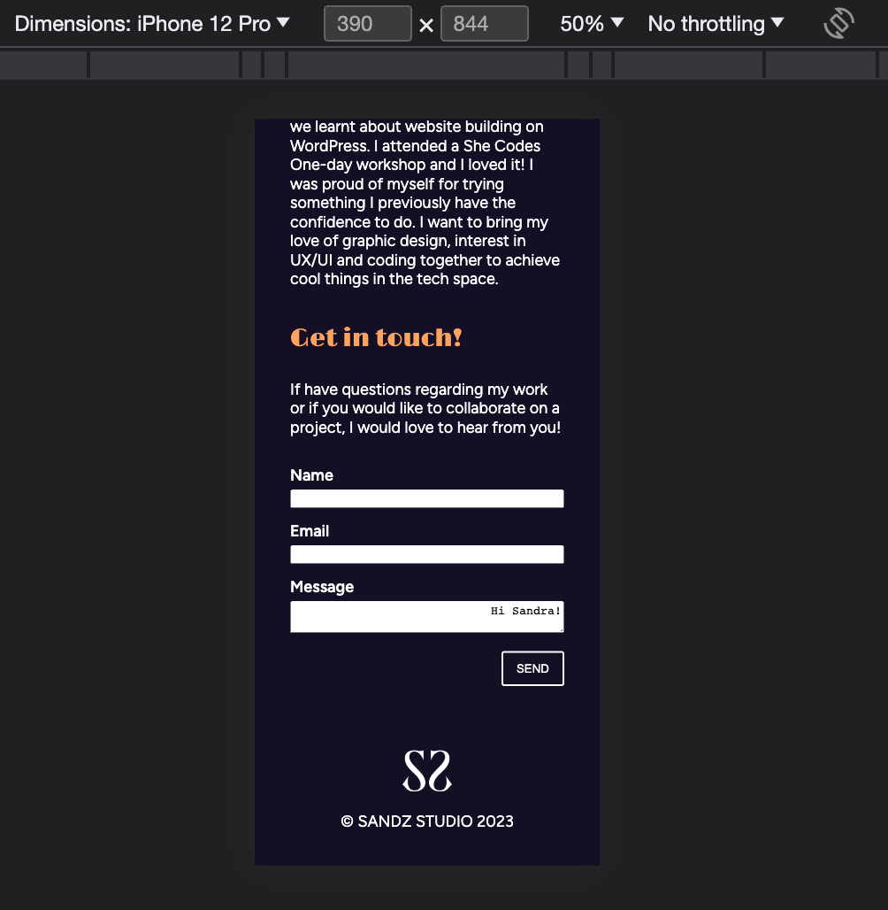
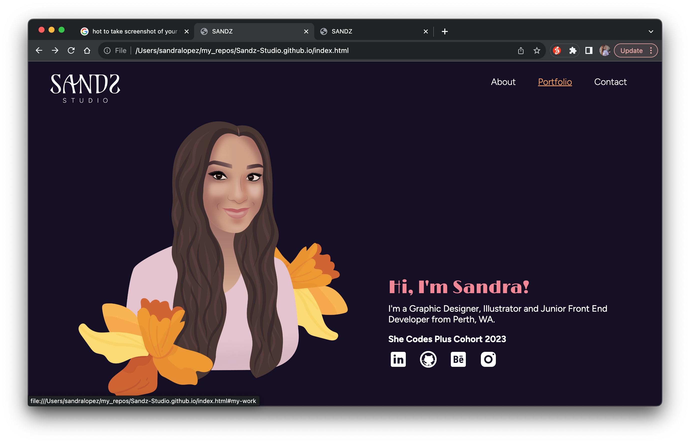
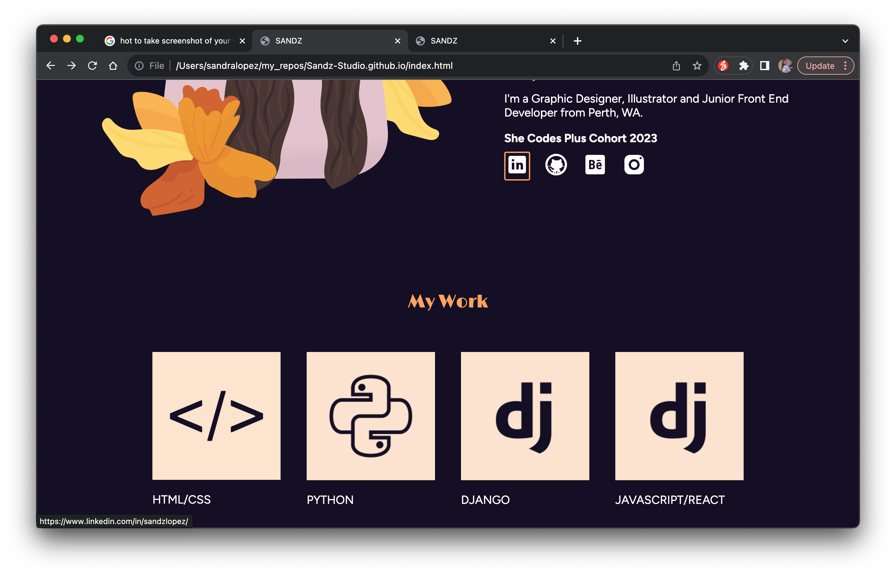
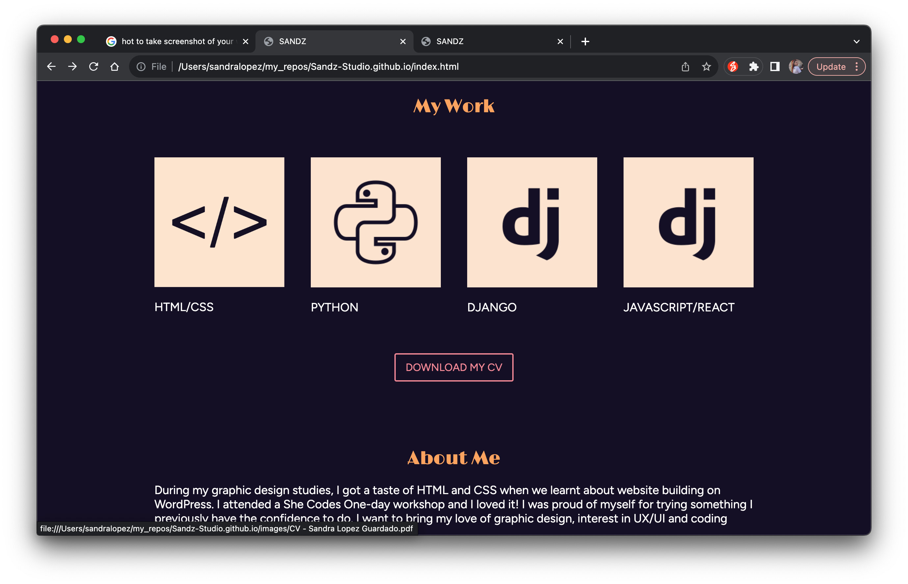

# Sandz-Studio.github.io
My First Portfolio

[My portfolio site]( https://Sandz-Studio.github.io )
## Project Requirements
### Content
I used an illustrated headshot and established Sandz Studio branding for my portfolio build. I have a short blurb in the hero section to grab the users attention and introduce myself. I have a longer about me section further down the page. My contact form is working however I had trouble getting the message to align to the left. The projects section is on the home page with child pages for each project.. All the links to external sites are working. I have linked to my linked In profile, GitHub repository, Behance and Instagram pages.
 - [x] At least one profile picture
 - [x] Biography (at least 100 words)
 - [x] Functional Contact Form
 - [x] "Projects" section
 - [x] Links to external sites, e.g. GitHub and LinkedIn.

### Technical
I have developed 2 webpages for my portfolio. A main landning page which has all the elements of my website displayed including my project section. The second page is for Project 1 - HTML/CSS brief. I attemped to version control but got an error message. I have now troubleshooting this error message. My pages are now deployed on GitHub Pages. My website is fully responsive on mobile and laptop screens. I developed for mobile first and then used media queries to make it work on a larger screen.
 - [x] At least 2 web pages.
 - [x] Version controlled with Git
 - [x] Deployed on GitHub pages.
 - [x] Implements responsive design principles.
 - [x] Uses semantic HTML.

### Bonus (optional)
A added styling for hover states for my linkes and buttons. I didn't add any for active states - somthing to experiment with in the future.
I didn't attempt to use Javascript for a hamburger menu as I didn't think I needed it for my website however I will be giving it a go.
 - [x] Different styles for active, hover and focus states.
- [ ] Include JavaScript to add some dynamic elements to your site. (Extra
tricky!)

#### Laptop Hero

#### Phone Hero

#### Contact Me on phone

#### Nav Hover

#### Social Link Hover

#### Download Button Hover

